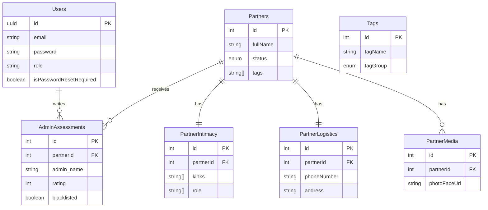

# Database Schema Reference

Defined in: `shared/schema.ts`
ORM: Drizzle ORM

## Entity Relationship Diagram

## Tables

### `users`

System administrators.

- `id`: UUID (Primary Key)
- `email`: Unique
- `role`: Enum (`admin`, `viewer`)

### `partners`

The core entity representing a person.

- `status`: Enum (`New Prospect`, `Active`, `Vetted`, etc.)
- `referralSource`: Enum (`Allison`, `Roxanne`)

### `partner_intimacy`

Private/Intimate details (1:1 with Partners).

- `kinks`: Array of strings
- `phallicLength`: Decimal
- `sexualOrientation`: String

### `partner_logistics`

Practical details (1:1 with Partners).

- `hosting`: Boolean
- `car`: Boolean
- `discreetDl`: Boolean

### `admin_assessments`

Reviews given by admins (1:N with Partners).

- Allows separate ratings from different admins.
- `blacklisted`: Boolean flag.

## Enums

- **Status**: `New Prospect, Contacted, Ready for Vetting, Vetted, Active, On Pause, Retired, Do Not Engage`
- **Role**: `admin, viewer`
- **Tag Group**: `Vibe, Logistics, Risk, Admin`
